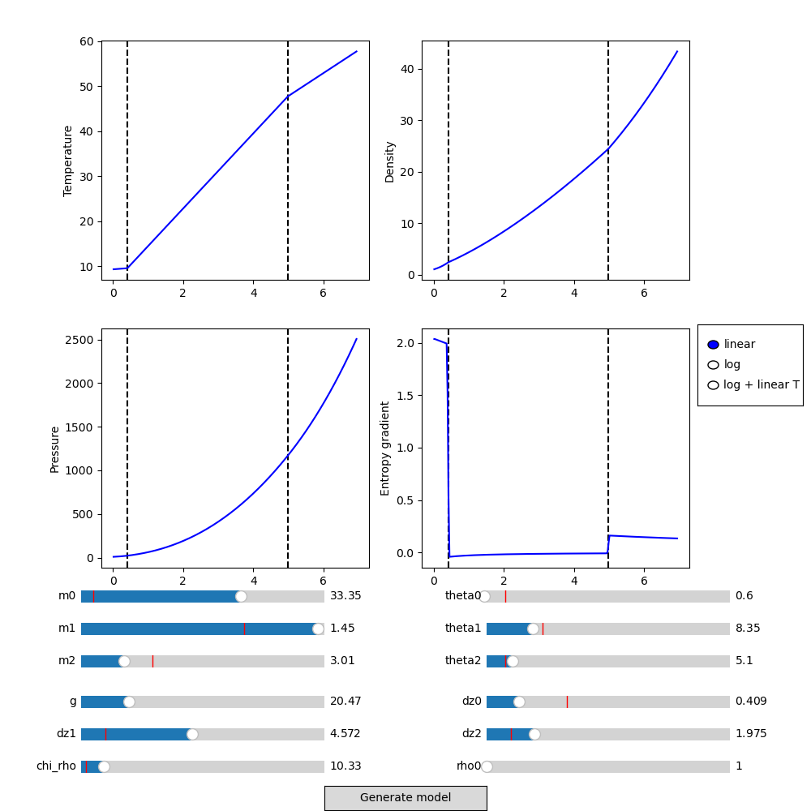

# Initial conditions generator for a tri-layer convective setup in Dyablo or FV2D

Simple python script generating `.ini` files for dyablo for a three-layer setup or fv2d/dyablo for a sandwich setup.

The setup is loosely based on the following papers : 

 * Hurlburt et al. 1986 - "Nonlinear compressible convection penetrating into stable layers and producing internal gravity waves" [[ADS](https://ui.adsabs.harvard.edu/abs/1986ApJ...311..563H/abstract)]
 * Brummel et al. 2002 - "Penetration and Overshooting in Turbulent Compressible Convection" [[ADS](https://ui.adsabs.harvard.edu/abs/2002ApJ...570..825B/abstract)]

 ## Dependencies
 * Python3
 * numpy
 * matplotlib

 ## Usage

 ### Tri Layer setup

To build a tri-layer setup for dyablo, start the interactive ic generator :
 ```bash
 python3 tri_layer_interactive.py
 ```

 The code will display an interactive figure allowing you to fine-tune the model you wish to generate :

 

If you're satisfied with the model, you can click on "generate model". The script will close the window (save the profile before if you wish to keep an image) and will move on to ask you other quantities related to the run. Finally a `.ini` file will be generated.

### Sandwich setup

The sandiwch setup is a tri-layer setup with the first and last zone having the exact same properties. It should not be used anymore but can still be generated using the `tri_layer_v1.py` script.

 ## Description of the calculations

 All the calculations necessary for the generation of the model can be found in [here](doc/Tri_Layer_Setup.pdf)