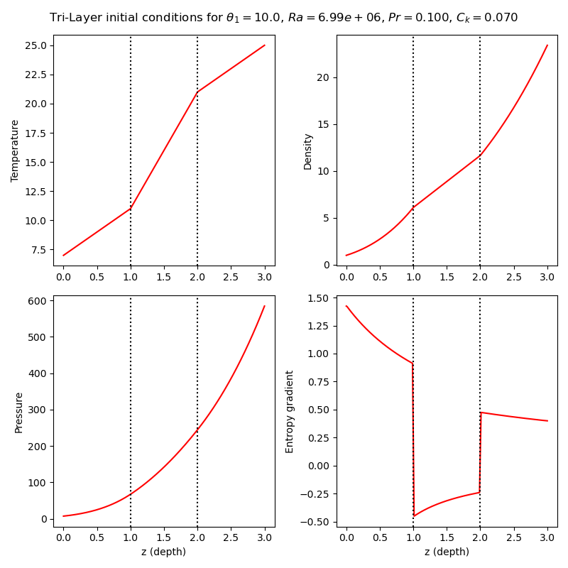

# Initial conditions generator for a tri-layer convective setup in Dyablo or FV2D

Simple python script generating `.ini` files for fv2d and dyablo for a three-layer setup.

The setup is loosely based on the following papers : 

 * Hurlburt et al. 1986 - "Nonlinear compressible convection penetrating into stable layers and producing internal gravity waves" [[ADS](https://ui.adsabs.harvard.edu/abs/1986ApJ...311..563H/abstract)]
 * Brummel et al. 2002 - "Penetration and Overshooting in Turbulent Compressible Convection" [[ADS](https://ui.adsabs.harvard.edu/abs/2002ApJ...570..825B/abstract)]

 ## Dependencies
 * Python3
 * numpy
 * matplotlib

 ## Usage

 The script is simply called directly in command line. Fill in the values for the script or use the default ones to get an `.ini` file for dyablo, one for FV2D, and some IC plots describing the setup generated.

 ```bash
 python3 ic_generator.py
 ```

 The code will generate the files in the same folder as the one the script was called on. Two figures are generated, one with the initial profiles : 

 

 and one with the speed of sound in the domain : 

 

 ## Description of the calculations

 TODO